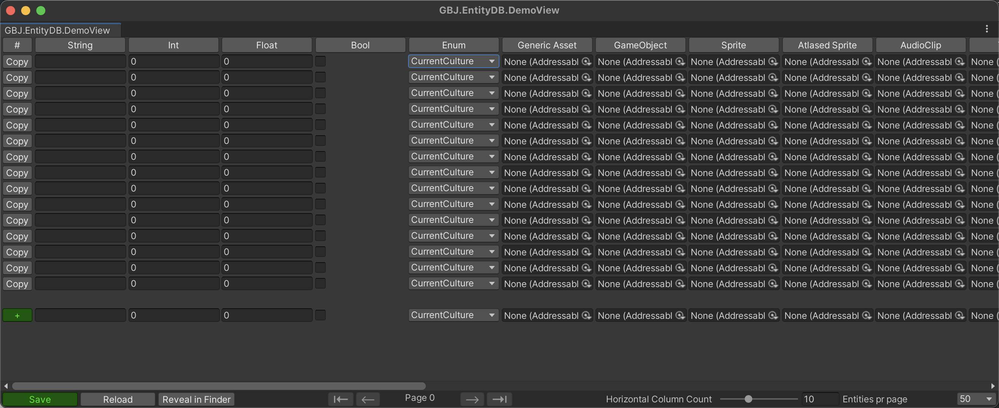
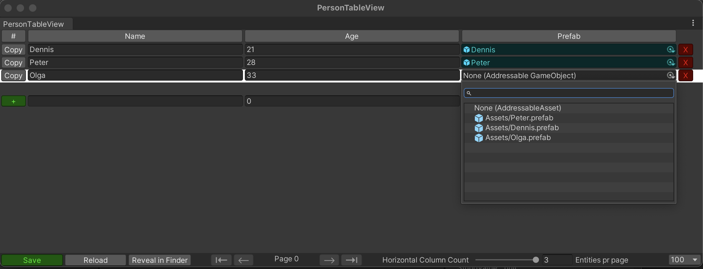
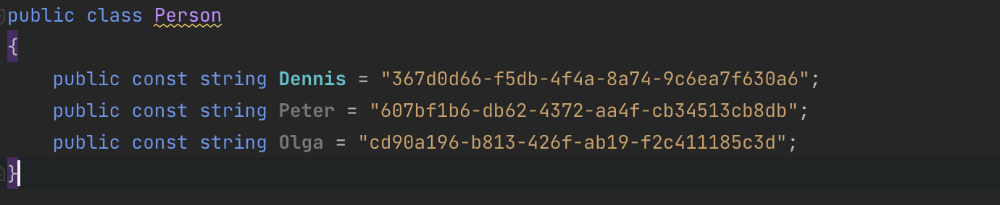
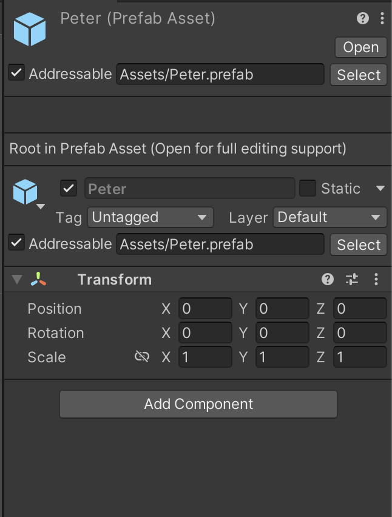

### Games By Johste presents: 
# Entity Database for Unity

A simple database utilizing addressable assets to reference almost any kind of native unity asset. Avoid having thousands of hard to compare ScriptableObjects and Prefabs in your project.
Great for keeping track of items, characters or quests.



## Features:

    Referance any Addressable Asset
    Typed property fields
    Searchable property fields
    Unsaved value Highlighting (Cyan)
    Busted Reference Highlighting (Red)
    Sortable by any column
    Pagination
    Adjustable horizontal column count for extra wide rows.
    Optional Constant Generation for Easy Code Referances

## Dependencies:
    Unity 2021
    Newtonsoft.Json
    Unity.Addressables

## Getting Started:

1. Define your entity inheriting from Entity.cs
```csharp
using GBJ.EntityDB;
using GBJ.EntityDB.AssetReferenceHolders;
using Newtonsoft.Json;

public class PersonEntity : Entity
{
    public string Name;
    public int Age;
    
    [JsonConverter(typeof(AssetReferenceHolderConverter<AssetReferenceGameObjectHolder>))]
    public AssetReferenceGameObjectHolder Prefab = new AssetReferenceGameObjectHolder();
}
```

2. Manually create your table view editor class e.g: /Editor/PersonTableView.cs
```csharp
using GBJ.EntityDB.Editor;
using UnityEditor;

public class PersonTableView : TableView<PersonEntity>
{
    [MenuItem("Tables/Persons")]
    static void Init() => Init<PersonTableView>();

    protected override int maxColumnCount => 3;
    protected override void CreateNewEntry() => @new = new PersonEntity();

    protected override void DrawColumnNames()
    {
        DrawColumn("Name", x => x.Value.Name);
        DrawColumn("Age", x => x.Value.Age);
        DrawColumn("Prefab", x => x.Value.Prefab);
    }

    protected override void DrawRow(PersonEntity entry, PersonEntity unmodified, bool changeColorIfChanged = false)
    {
        this.DrawEntry(() => entry.Name, x => entry.Name = x, changeColorIfChanged, () => unmodified?.Name);
        this.DrawEntry(() => entry.Age, x => entry.Age = x, changeColorIfChanged, () => unmodified?.Age);
        this.DrawEntry(() => entry.Prefab, x => entry.Prefab = x, changeColorIfChanged, () => unmodified?.Prefab);
    }
}
```

3. Find persons table in your toolbar


4. Inspect your table in all of its glory.



5. To use your table in game:

```
using GBJ.EntityDB;
using UnityEngine;

public class PersonTableUsageSample : MonoBehaviour
{
    private Table<PersonEntity> personTable;
    void Awake()
    {
        personTable.Load();
        PersonEntity person = personTable.GetById(Person.Dennis);
        Debug.Log($"{person.Name} is {person.Age} years old.");
    }
}
```

## Constant Generation:

To enable automatic constant generation for easy code reference: Override the following in your TableView class:
```
protected override bool GenerateConstants => true;
protected override string GetPropertyConstantName(PersonEntity entity) => entity.Name;
```



## Supported Value Types:

### Generics:

```csharp
string
int
float
bool
enum
```

### Asset References:

```csharp
AnimationClip
Atlased Sprite
AudioClip
AudioMixer
ComputerShader
Font
GUISkin
GameObject (Prefab)
Generic Addressable Asset
Material
Mesh
Model
PhysicsMaterial
Scene
Shader
Sprite
Texture
Texture2D
Texture3D
VideoClip
```

## FAQ:

```
Q: How is my Database / Table saved?
A: Its saved as Json 
```

```
Q: Where is my Database / Table saved?
A: By default its saved to $"{Application.dataPath}/Resources/{typeof(T).Name}.db.json";
```

```
Q: My asset is not serialized
A: Make sure the Asset Reference Property is annoted with the correct Annotation

[JsonConverter(typeof(AssetReferenceHolderConverter<AssetReferenceGameObjectHolder>))]
public AssetReferenceGameObjectHolder Prefab = new AssetReferenceGameObjectHolder();
```

```
Q: My asset does not appear / is not assignable to my property field.
A: Before an asset can be assigned it must first be marked as addressable.
```



### Improvement areas:

> Reduce code repetition: Addressable Assets Property fields are very difficult to render in custom editor windows. 
Because of this the project has a lot boilerplate code repetition than I'm comfortable with. 

> Make it easier to change where tables and constants are saved.

> Autogenerate TableViews

> Backport to older Unity versions.

PR's are welcome.
